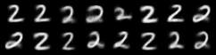
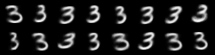
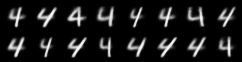

# 🎯 PyTorch MNIST Conditional VAE

[](https://pytorch.org/)
[](https://python.org/)
[](LICENSE)

A **Conditional Variational AutoEncoder (CVAE)** implementation for MNIST digit generation with **controlled digit synthesis**. Generate specific digits (0-9) on demand using one-hot encoded labels and raw MNIST data loading.

## ✨ What Makes This Special?

- 🎲 **Controlled Generation**: Generate any specific digit (0-9) by providing target labels
- 📊 **Raw Data Processing**: Direct loading from MNIST binary files for maximum control
- 🔄 **One-hot Encoding**: Proper label conditioning for better generation quality
- 🏗️ **Custom Architecture**: 794-dimensional input (784 image + 10 label) for conditional training
- 🎨 **High-Quality Output**: Clean, recognizable digit generation

## 🚀 Quick Start

```bash
# Clone the repository
git clone https://github.com/yourusername/pytorch-mnist-conditional-vae.git
cd pytorch-mnist-conditional-vae

# Install dependencies
pip install torch torchvision numpy matplotlib

# Run the notebook
jupyter notebook pytorch-mnist-VAE.ipynb
```

```python
# Generate specific digits
samples = generate_conditional_samples(digit=5, num_samples=16)
save_image(samples.view(16, 1, 28, 28), 'digit_5.png')
```

## 📋 Dependencies
- **PyTorch** - Deep learning framework
- **torchvision** - Computer vision utilities
- **numpy** - Numerical computing
- **matplotlib** - Visualization

## Architecture
- **Encoder**: Takes concatenated image+label (794 dims) → latent space (2 dims)
- **Decoder**: Takes latent vector + label → reconstructed image (784 dims)
- **Conditional Training**: Uses both image and label information for better generation control

## 🎨 Generated Results

### Conditional Digit Generation
Generate specific digits by providing target labels - each row shows 16 samples of the requested digit:

| Digit | Generated Samples |
|-------|------------------|
| **0** |  |
| **1** |  |
| **2** |  |
| **3** |  |
| **4** |  |

> **Note**: All samples are generated from random latent vectors conditioned on the target digit label. The model learns to generate diverse variations of each digit while maintaining digit identity.

## Usage
```python
# Generate specific digit
samples = generate_conditional_samples(digit=5, num_samples=16)

# Load raw MNIST data
train_images = load_mnist_images('./mnist_data/raw/train-images-idx3-ubyte')
train_labels = load_mnist_labels('./mnist_data/raw/train-labels-idx1-ubyte')

# Convert to one-hot encoding
train_labels_onehot = F.one_hot(train_labels_tensor, num_classes=10).float()

# Concatenate for conditional training
train_conditional_data = torch.cat([train_images_flat, train_labels_onehot], dim=1)
```

## Key Improvements
1. **Conditional VAE**: Modified architecture to handle label conditioning
2. **Raw Data Loading**: Direct loading from MNIST binary files
3. **One-hot Encoding**: Proper label encoding for conditional generation
4. **Controlled Generation**: Generate specific digits by providing target labels
5. **Better Architecture**: Separate handling of image and label components

## 📚 References & Acknowledgments

1. **Auto-Encoding Variational Bayes** - Diederik P Kingma, Max Welling (paper): 
   https://arxiv.org/abs/1312.6114
2. **Original PyTorch MNIST VAE** - lyeoni (github):
   https://github.com/lyeoni/pytorch-mnist-VAE/tree/master
3. **Basic VAE Example** - PyTorch Examples (github): 
   https://github.com/pytorch/examples/tree/master/vae
4. **TensorFlow MNIST VAE** - hwalsuklee (github): 
   https://github.com/hwalsuklee/tensorflow-mnist-VAE

## 🤝 Contributing

Contributions are welcome! Please feel free to submit a Pull Request. For major changes, please open an issue first to discuss what you would like to change.

## 📄 License

This project is licensed under the MIT License - see the [LICENSE](LICENSE) file for details.

## ⭐ Star History

If you found this project helpful, please give it a star! ⭐

---

**Built with ❤️ using PyTorch**
